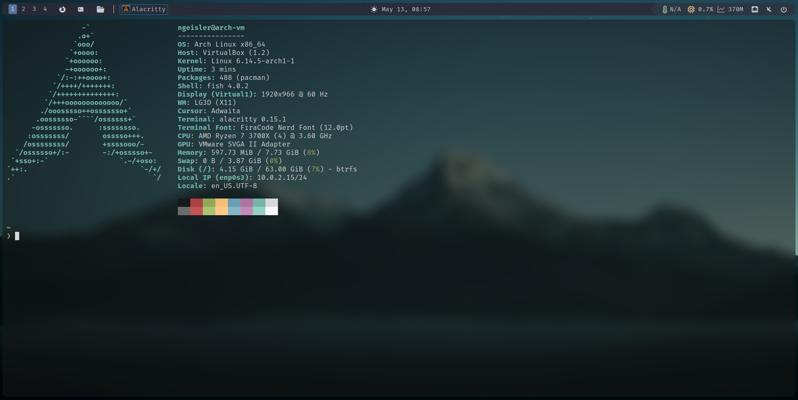

# Qtile config



## What is Qtile?

Qtile is a dynamic, hackable window manager for Linux and other Unix-like operating systems, written entirely in Python.

It is designed to be highly customizable, allowing users to tweak its behavior, appearance, and functionality through Python scripts.

Qtile works with both X11 and Wayland.

## How to use

### Required packages

```sh
sudo pacman -S qtile picom python-psutil python-iwlib
```
